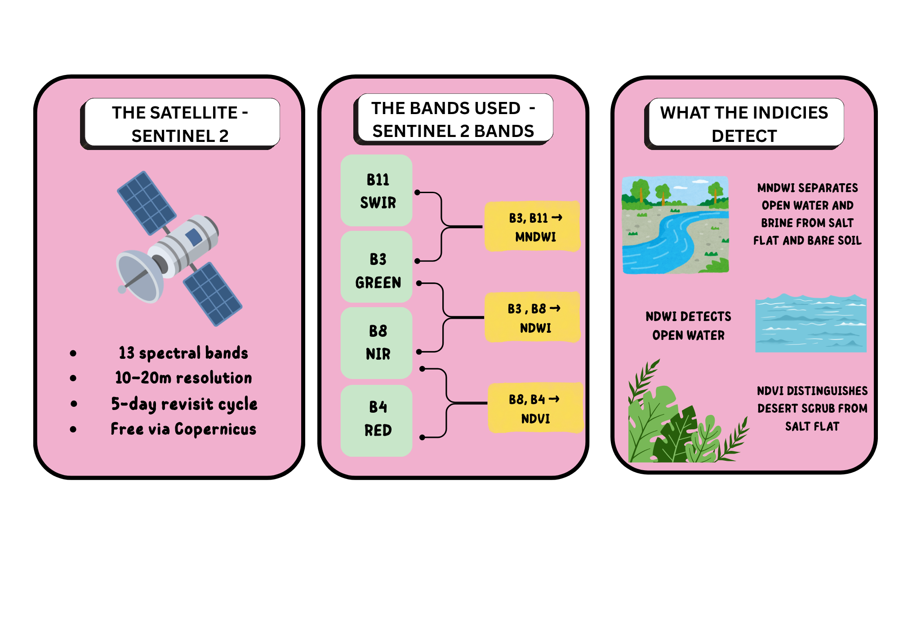
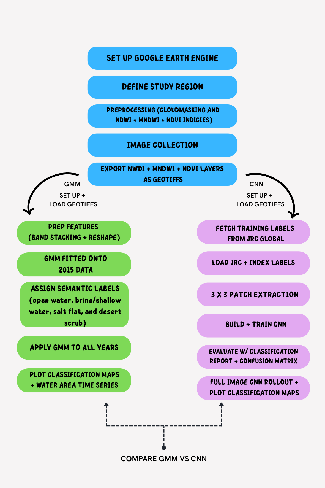
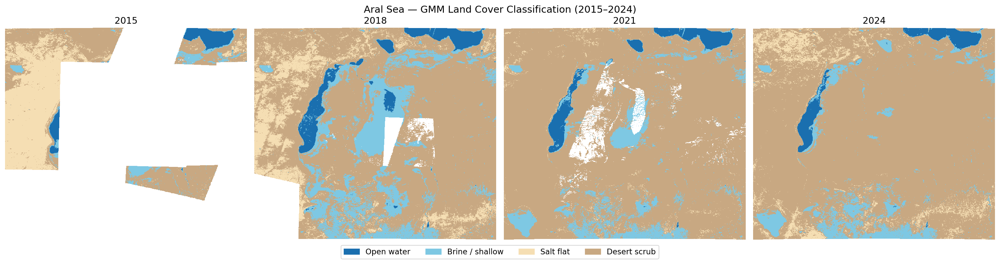
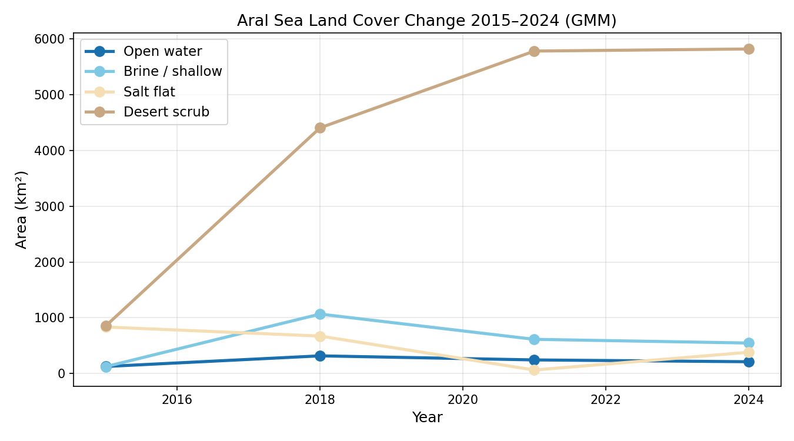
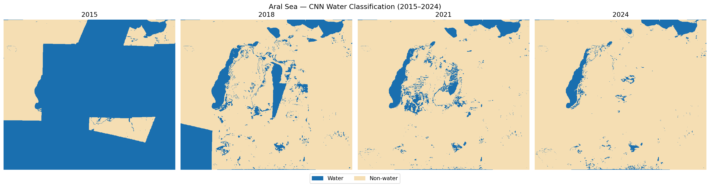
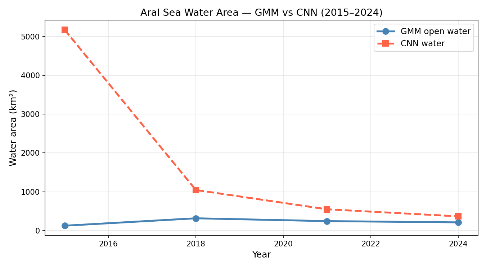
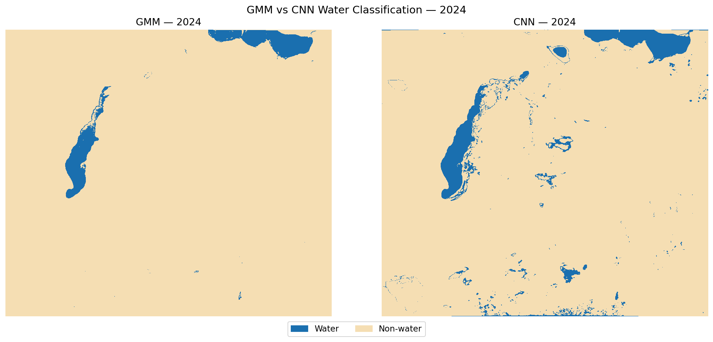
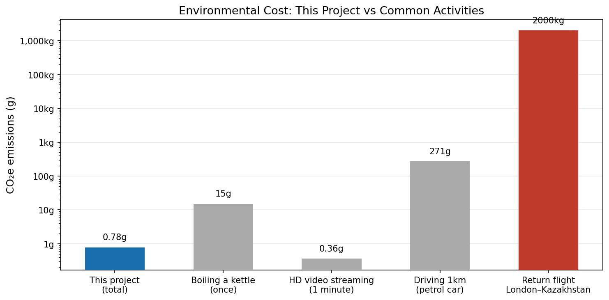

# Aral Sea Ecosystem Collapse: Water Body Change Detection Using Sentinel-2 and Machine Learning (2015–2024)

## Contents

- [Introduction](#Introduction)
- [Background and Motivation](#background-and-motivation)
- [Research Questions, Data & Pre-processing](#research-questions-data--pre-processing)
- [Methodology](#methodology)
- [Notebook Overview](#notebook-overview)
- [Results](#results)
- [Environmental Cost](#environmental-cost)
- [Limitations and Future Work](#limitations-and-future-work)
- [Acknowledgements](#acknowledgements)
- [References](#references)

## Introduction
This is the final project for the GEOL0069 AI for Earth Observation module 
at UCL. It applies unsupervised and supervised machine learning to Sentinel-2 
satellite imagery to monitor the ongoing collapse of the Aral Sea — once the 
world's fourth largest lake.

Google Earth Engine is used to access imagery across four time periods (2015, 
2018, 2021, 2024), classifying the lake basin into four land cover types — 
open water, brine/shallow water, salt flat, and desert scrub — to track how 
each has changed over time.

Two methods are compared:
- **GMM (Gaussian Mixture Model)** — unsupervised classification, no labels required
- **CNN (Convolutional Neural Network)** — supervised, trained on water occurrence 
  labels from the JRC Global Surface Water dataset

Together these allow a direct assessment of how an unsupervised and a supervised 
approach differ in detecting water body change across a spectrally complex, 
arid environment.

## Background and Motivation

The Aral Sea, located on the border of Kazakhstan and Uzbekistan, was once 
one of the largest inland bodies of water on Earth. Soviet-era irrigation 
projects from the 1960s diverted its two feeding rivers towards cotton 
agriculture, resulting in a 90% decrease in volume and 74% reduction in 
surface area — one of the most dramatic environmental catastrophes of the 
twentieth century (Micklin, 2007).

The exposed lakebed — now the Aralkum Desert — has become one of Central 
Asia's most active dust and salt storm sources, with storms growing more 
powerful as more of the lake bottom is exposed (Indoitu et al., 2015). 
The dust is heavily contaminated with salt, fertilisers and pesticides, 
causing throat cancer, anaemia and kidney disease in surrounding communities, 
with infant mortality among the highest in the world (Encyclopaedia 
Britannica, 2024). Tracking the ongoing expansion of bare surfaces is 
therefore not only an environmental monitoring task but one with direct 
public health implications.

This project classifies the basin into four land cover types — open water, 
brine/shallow water, salt flat, and desert scrub — chosen because they 
represent the sequential stages of ecological collapse, from open water 
through progressive evaporation and salinisation to bare desert, allowing 
the drying process to be tracked and quantified over time.

Satellite remote sensing is well suited to this monitoring task — field 
surveys in the basin are logistically difficult and prohibitively expensive 
at scale. Sentinel-2, with its 10–20m resolution, 5-day revisit cycle, and 
freely accessible Copernicus archive, provides a consistent long-term record 
for systematic change detection (ESA, 2015).

## Research Questions, Data & Pre-processing

This project addresses two questions:

1. How have the four land cover classes of the Aral Sea basin — open water, 
   brine, salt flat, and desert scrub — changed in spatial extent between 
   2015 and 2024?
2. How do unsupervised (GMM) and supervised (CNN) classification methods 
   compare in their ability to detect and quantify these changes?

All imagery is sourced from the Sentinel-2 Level-2A surface reflectance 
data, accessed via Google Earth Engine (GEE) (ESA, 2015). Training labels 
for the CNN are sourced independently from the JRC Global Surface Water 
dataset, also accessed via GEE.

Three water-sensitive spectral indices are computed:

- **NDWI** (Normalised Difference Water Index): (Green − NIR) / (Green + NIR) 
  — detects open water (McFeeters, 1996)
- **MNDWI** (Modified Normalised Difference Water Index): (Green − SWIR) / (Green + SWIR) 
  — separates water from salt flat and bare soil (Xu, 2006)
- **NDVI** (Normalised Difference Vegetation Index): (NIR − Red) / (NIR + Red) 
  — distinguishes desert scrub from bare salt crust 

Water-focused indices are used rather than vegetation indices, as the key 
challenge in the Aral Sea basin is separating open water and shallow brine 
from dry salt flat.

*Figure 1: Sentinel-2 satellite overview showing the four spectral bands 
used in this project (B3, B4, B8, B11) and the water-sensitive indices 
derived from them.*

## Methodology

*Figure 2: AI methodology workflow showing the shared preprocessing 
pipeline and the two parallel classification approaches — GMM 
(unsupervised) and CNN (supervised) — converging at the final 
GMM vs CNN comparison. Blue = Notebook 1 (preprocessing), Green = 
Notebook 2 (GMM), Purple = Notebook 3 (CNN). Refer to the notebooks 
for full implementation details.*

**GMM** is chosen over K-means as it assigns soft probabilistic class 
memberships rather than hard boundaries, better reflecting the gradual 
transitions between land cover types in an arid environment. The model 
is trained on 2015 imagery and applied to all four years without 
retraining, ensuring pixel count changes reflect genuine land cover 
change.

**CNN** processes 3×3 spatial patches incorporating neighbourhood 
context around each pixel, trained on JRC Global Surface Water labels 
entirely independently of the GMM — making the comparison between the 
two methods meaningful.

## Notebook Overview

**01_preprocessing.ipynb**
Fetches Sentinel-2 imagery for 2015, 2018, 2021 and 2024 via GEE, applies 
cloud masking, computes NDWI/MNDWI/NDVI, and exports GeoTIFFs to Google Drive.

**02_unsupervised_gmm.ipynb**
Loads the index stacks, applies GMM classification, and produces land cover 
maps and a water area time series for each year.

**03_supervised_cnn.ipynb**
Fetches JRC water labels, trains a CNN on 3×3 spatial patches, rolls it out 
across the full image, and compares results against the GMM.

All notebooks are adapted from GEOL0069 Jupyter Notebook — attribution is 
noted at the top of each notebook.

## Results

### GMM Classification Maps

*Figure 3: GMM land cover classification across the Aral Sea basin for 
2015, 2018, 2021 and 2024. White areas reflect cloud-masked pixels 
excluded during preprocessing.*

The GMM maps show a dramatic expansion of desert scrub across the basin, 
from 854 km² in 2015 to 5,818 km² in 2024 (see table 1). Open water and brine remain 
concentrated in the North Aral Sea and towards the west, with brine also 
present in the south.

### Water Area Time Series

*Figure 4: Area (km²) per land cover class across all four time periods.*

| Class | 2015 (km²) | 2018 (km²) | 2021 (km²) | 2024 (km²) |
|---|---|---|---|---|
| Open water | 126 | 317 | 244 | 212 |
| Brine / shallow | 124 | 1,066 | 613 | 547 |
| Salt flat | 834 | 672 | 63 | 382 |
| Desert scrub | 854 | 4,405 | 5,781 | 5,818 |

*Table 1: GMM land cover area estimates (km²) for the Aral Sea basin 
across all four time periods.*

Desert scrub expanded by **4,964 km²** over the study period — the largest 
land cover change in the basin. Open water interestingly showed a small increase of 
85 km², likely reflecting interannual variability rather than genuine 
recovery.

### CNN Classification Maps

*Figure 5: CNN water/non-water classification for 2015, 2018, 2021 and 
2024. The anomalously large water extent in 2015 is a known limitation 
discussed in the limitations section.*

The CNN maps broadly confirm the water recession trend from 2018 onwards. 
The unusually large water area in 2015 is caused by cloud-masked pixels 
filled with zeros being incorrectly classified as water by the CNN.

### GMM vs CNN Comparison

*Figure 6: Water area estimates from GMM and CNN across all four years. 
Both methods show a declining trend from 2018 to 2024.*

*Figure 7: Side-by-side classification maps for 2024 showing where the 
two methods agree and disagree on water extent.*

| Metric | CNN |
|---|---|
| Overall accuracy | 0.64 |
| F1 — Water | 0.74 |
| F1 — Non-water | 0.45 |

Both methods identify the same main water bodies but the CNN detects more 
scattered smaller water features, likely due to its use of spatial context 
when classifying each pixel shown in figure 5. The CNN achieved an overall accuracy of 0.64, 
with water detection (F1 = 0.74) outperforming non-water classification 
(F1 = 0.45).

### Key Findings

- Desert scrub expanded by **4,964 km²** between 2015 and 2024 — the 
  dominant land cover change in the basin
- Both methods confirm the water recession trend despite methodological 
  differences, suggesting the results are robust
- The 2015 CNN map is affected by a known data limitation and should be 
  interpreted with caution

> **Why this matters**
>
> The 4,964 km² expansion of desert scrub identified in this study represents 
> new potential dust source area across the exposed lakebed. This is consistent 
> with Indoitu et al. (2015), who identified the Aralkum as one of Central 
> Asia's most active dust and salt storm sources. The continued expansion of 
> bare surfaces detected here suggests that **dust hazard exposure for the 
> millions of people living across Central Asia is likely to have increased 
> over the study period** — a finding that underscores the public health 
> urgency of monitoring the Aral Sea basin.

## Environmental Cost

Monitoring the Aral Sea basin by field survey would require international 
travel to Central Asia and further transport — producing around **2,000 kg CO₂**. 
This entire computational pipeline produced less than 1 gram.

*Comparison values are approximate estimates based on standard assumptions 
and intended for illustrative purposes only.*

Emissions per notebook (20W CPU, UK grid intensity 0.233 kg CO₂/kWh):

- **Notebook 1** — 0.61 min · 0.20 Wh · 0.047 g CO₂e
- **Notebook 2** — 0.77 min · 0.26 Wh · 0.059 g CO₂e
- **Notebook 3** — 8.68 min · 2.89 Wh · 0.674 g CO₂e
- **Total** — 10.07 min · 3.36 Wh · **0.78 g CO₂e** · £0.001

Several methodological decisions kept emissions low:

- **Reduced export resolution** — imagery exported at 500m rather than 
  Sentinel-2's native 10m, significantly reducing file sizes and processing time
- **Pixel subsampling** — both GMM and CNN were trained on pixel subsamples 
  rather than the full image, avoiding unnecessary computation
- **CPU-only sessions** — all computation ran on CPU-only Google Colab 
  sessions with no GPU usage
- **GEE cloud processing** — satellite preprocessing handled by Google Earth 
  Engine's infrastructure rather than locally

## Limitations and Future Work

**CNN 2015 anomaly:** Cloud-masked pixels filled with zero values are 
incorrectly classified as water during the CNN rollout, producing an 
anomalously large water extent in 2015. Masking these pixels out of the 
final classification rather than filling them with zeros would resolve 
this issue in future work.

**Spatial and temporal resolution:**  Imagery was exported at 500m resolution 
due to memory limitations in Google Colab, which may miss fine-scale 
shoreline detail. Only four time steps are analysed — more frequent 
composites would give a fuller picture of how water loss progressed 
over time.

**Sentinel-2 archive:** Sentinel-2 only launched in 2015, so the most 
dramatic Aral Sea shrinkage (1960–2000) falls outside the study period. 

**Future work:** Testing the same pipeline on other shrinking 
lakes such as Urmia Lake or Lake Chad would show how well the approach 
transfers to different regions.

## Acknowledgements
This project was developed for GEOL0069 AI4EO 2025/2026 at UCL. Thank you to the module team: Dr Michel Tsamados, Weibin Chen, and Shambhu Bhandari Sharma for the teaching materials this project builds on.

## References 

- Britannica (2026). Aral Sea. Available at: https://www.britannica.com/place/Aral-Sea

- ESA (2015). SENTINEL-2 User Handbook Sentinel-2 User Handbook. Available at: https://sentinels.copernicus.eu/documents/247904/685211/Sentinel-2_User_Handbook (Accessed: 17 May 2026)

- Indoitu, R., Kozhoridze, G., Batyrbaeva, M., Vitkovskaya, I., Orlovsky, N., Blumberg, D. and Orlovsky, L. (2015). 'Dust emission and environmental changes in the dried bottom of the Aral Sea', Aeolian Research, 17, pp.101–115. doi:10.1016/j.aeolia.2015.02.004.

- McFEETERS, S.K. (1996). 'The use of the Normalized Difference Water Index (NDWI) in the delineation of open water features', International Journal of Remote Sensing, 17(7), pp.1425–1432. doi:10.1080/01431169608948714.

- Micklin, P. (2007). 'The Aral Sea Disaster', The Aral Sea Disaster, 35, pp.47-72. doi:10.1146/annurev.earth.35.031306.140120.

- Tsamados, M. and Chen, W. (2022) GEOL0069: Artificial Intelligence for Earth Observation – course notebook. University College London. Available at: https://cpomucl.github.io/GEOL0069-AI4EO/intro.html

- Xu, H. (2006). 'Modification of normalised difference water index (NDWI) to enhance open water features in remotely sensed imagery', International Journal of Remote Sensing, 27(14), pp.3025–3033. doi:10.1080/01431160600589179.

[Add contact information here]
